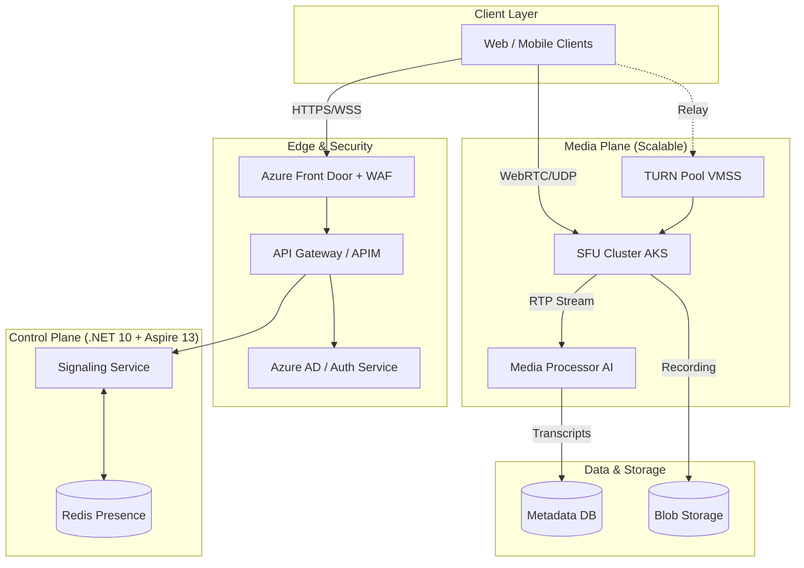
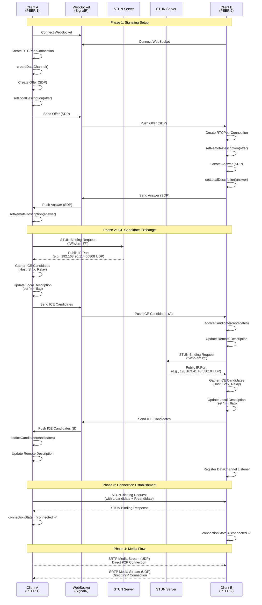

# System Architecture: AI-Enhanced Video Conferencing

> **Context**: This design reflects a whiteboard session for an AI Architect role. The goal is to design a scalable video conferencing system with integrated AI capabilities.

## Table of Contents

- [Part 1: Requirements Analysis](#part-1-requirements-analysis)
  - [Functional Requirements (Capabilities)](#functional-requirements-capabilities)
  - [Non-Functional Requirements (NFR)](#non-functional-requirements-nfr)
- [Part 2: High-Level Architecture Components](#part-2-high-level-architecture-components)
  - [Client Layer](#client-layer)
  - [Identity & Security](#identity--security)
  - [API & Orchestration](#api--orchestration)
  - [Data & Storage](#data--storage)
  - [AI Services (The "AI Architect" Focus)](#ai-services-the-ai-architect-focus)
  - [Observability](#observability)
  - [Architecture Diagram (Mermaid)](#architecture-diagram-mermaid)
- [Part 3: Concurrency, Signaling & WebRTC Fundamentals](#part-3-concurrency-signaling--webrtc-fundamentals)
  - [Key Discussion Points (Interview Focus)](#key-discussion-points-interview-focus)
    - [Handling Concurrency & Real-Time Media](#handling-concurrency--real-time-media)
    - [AI Latency & Streaming](#ai-latency--streaming)
    - [Data Privacy & Consent](#data-privacy--consent)
    - [Storage Costs & Lifecycle](#storage-costs--lifecycle)
- [Part 4: Deep Dive: Transport Protocols & Connectivity](#part-4-deep-dive-transport-protocols--connectivity)
  - [1. Transport Protocols: TCP vs. UDP](#1-transport-protocols-tcp-vs-udp)
    - [TCP (Transmission Control Protocol)](#tcp-transmission-control-protocol)
    - [UDP (User Datagram Protocol)](#udp-user-datagram-protocol)
  - [2. Connectivity & NAT Traversal](#2-connectivity--nat-traversal)
    - [STUN (Session Traversal Utilities for NAT)](#stun-session-traversal-utilities-for-nat)
    - [TURN (Traversal Using Relays around NAT)](#turn-traversal-using-relays-around-nat)
  - [3. The Signaling Process](#3-the-signaling-process)
  - [4. HTTP Tunneling for Restrictive Networks](#4-http-tunneling-for-restrictive-networks)
- [Next Steps: Detailed Design & Implementation](#next-steps-detailed-design--implementation)

---

## Part 1: Requirements Analysis

### Functional Requirements (Capabilities)

Based on the whiteboard session, the system must support:

1. **Core Communication**: Real-time Video, Audio, and Text chat.

2. **Collaboration Tools**: File sharing and Screen sharing.

3. **AI & Intelligence**:

   * **Real-time Translation**: Live translation of speech.
   * **Transcription (Script)**: Generating text transcripts of meetings.

4. **Integration & Compliance**:

   * **Consent**: Managing user consent for recording/AI processing.
   * **External API**: Exposing functionality for third-party integrations.

5. **Management**:

   * **Dashboard**: For analytics and user management.

### Non-Functional Requirements (NFR)

* **Scale**: Support **2,000 concurrent users** per hour.
* **Latency**: Low latency for real-time media (< 200ms).
* **Observability**: Comprehensive metrics and monitoring.
* **Availability**: High availability (99.99%) for core meeting services.
* **Security**: End-to-end encryption and role-based access control (RBAC).

## Part 2: High-Level Architecture Components

The proposed architecture consists of the following key components:

### Client Layer

* **Web / UI**: The frontend interface (React/Angular) for users to join meetings.
* **Mobile App**: Native iOS/Android apps.
* **SDKs**: Client SDKs for handling media streams (WebRTC) and signaling.

### Identity & Security

* **Identity System**: Manages User Login and authentication.
  * **Technology**: Azure AD / Entra ID, Auth0, or Keycloak.
  * **Flow**: OIDC/OAuth2 for secure token-based access.
* **Consent Management**: Module to handle user permissions.
  * **Critical for AI**: Users must explicitly opt-in for recording and AI analysis (GDPR/CCPA compliance).
  * **Granularity**: Consent per meeting or per organization.

### API & Orchestration

* **APIG (API Gateway)**: Entry point for all client requests.
  * **Responsibilities**: Routing, Rate Limiting, SSL Termination, Authentication verification.
  * **Technology**: Azure API Management, Kong, or Nginx.
* **MT (Multi-tenancy)**: Architecture support for serving multiple distinct customers/organizations.
  * **Isolation**: Logical isolation of data and configuration per tenant.

### Data & Storage

* **Postgres**: Relational database for structured data.
  * **Use Cases**: User profiles, Meeting metadata (start/end time, participants), Chat logs, Tenant config.
  * **Scaling**: Read replicas for high read traffic (e.g., dashboard views).
* **Blob Storage**: Object storage for unstructured data.
  * **Use Cases**: Video recordings (MP4/WebM), Shared files, Transcripts.
  * **Technology**: Azure Blob Storage / AWS S3.
  * **Lifecycle**: Hot tier for recent meetings, Cool/Archive tier for older recordings.
* **Redis**: In-memory cache.
  * **Use Cases**: Session state, real-time presence (who is online), meeting status.

### AI Services (The "AI Architect" Focus)

* **Azure AI Services**:
  * **Speech-to-Text**: For real-time transcription.
    * **Pattern**: Stream audio chunks -> STT API -> Text stream.
  * **Translation**: For live language translation.
    * **Pattern**: Text stream -> Translation API -> Translated Text -> Broadcast to clients.
  * **Content Safety**: For moderating text/audio.
    * **Use Case**: Detect PII or toxic language in real-time.

### Observability

* **Prometheus**: Metric collection.
  * **Metrics**: QPS, Latency, Error rates, Active meetings, Connected users.
* **Grafana**: Visualization.
  * **Dashboards**: "System Health", "AI Usage Costs", "Tenant Usage".
* **Distributed Tracing**: Jaeger / Azure Monitor.
  * **Goal**: Trace a request from Client -> Gateway -> Meeting Service -> AI Service.

### Architecture Diagram (Mermaid)



## Part 3: Concurrency, Signaling & WebRTC Fundamentals

### Key Discussion Points (Interview Focus)

#### Handling Concurrency & Real-Time Media

* **Challenge**: Supporting 2,000 concurrent users with low latency.
* **Solution**:
  * **WebRTC**: Use WebRTC for peer-to-peer (P2P) media streaming for small groups (1:1 or small teams).
  * **SFU (Selective Forwarding Unit)**: For larger meetings, use an SFU (like Mediasoup or Jitsi) to route media streams centrally. This reduces client bandwidth.
  * **SignalR / WebSockets**: For signaling (setting up the call) and real-time chat/events.
  * **Horizontal Scaling**: Stateless signaling servers scaled behind a load balancer. Sticky sessions may be needed for WebSocket connections.

#### AI Latency & Streaming

* **Challenge**: Real-time translation must not introduce noticeable lag (lip-sync issues).
* **Solution**:
  * **Streaming APIs**: Use gRPC or WebSocket-based streaming APIs for Speech-to-Text (STT). Do not wait for a full sentence to finish; process audio chunks (e.g., 100ms).
  * **Edge Deployment**: Deploy AI models closer to the user (if using custom models) or use region-specific Azure AI endpoints.
  * **Optimistic UI**: Display tentative transcripts immediately and correct them as the model refines confidence.

#### Data Privacy & Consent

* **Challenge**: AI processing involves sending voice/text to cloud services.
* **Solution**:
  * **Explicit Consent**: "This meeting is being recorded/analyzed." Pop-up must block join until accepted.
  * **PII Redaction**: Use Azure AI Content Safety to detect and redact PII (names, phone numbers) from transcripts *before* storage.
  * **Ephemeral Processing**: Ensure audio sent to AI services is not stored by the provider (zero data retention policy).

#### Storage Costs & Lifecycle

* **Challenge**: Storing HD video recordings is expensive.
* **Solution**:
  * **Tiering**:
    * **Hot**: First 30 days (instant access).
    * **Cool**: 30-90 days (slightly lower cost, millisecond access).
    * **Archive**: > 90 days (lowest cost, hours to retrieve).
  * **Transcoding**: Compress videos after the meeting ends (e.g., convert raw stream to H.264/H.265).
  * **Retention Policy**: Auto-delete recordings after X days based on tenant configuration.

## Part 4: Deep Dive: Transport Protocols & Connectivity

### 1. Transport Protocols: TCP vs. UDP

For a video conferencing system, the choice of transport protocol is critical for user experience.

#### TCP (Transmission Control Protocol)

* **Characteristics**: Connection-oriented, reliable, ordered delivery.
* **Mechanism**: Uses a 3-way handshake to establish connection. Retransmits lost packets (Automatic Repeat Request - ARQ).
* **Suitability**: Ideal for **Signaling** (call setup, user status) where data integrity is paramount.
* **Drawback for Media**: The retransmission mechanism introduces latency (Head-of-Line blocking). In real-time video, a delayed packet is worse than a lost packet.

#### UDP (User Datagram Protocol)

* **Characteristics**: Connectionless, unreliable, unordered delivery.
* **Mechanism**: "Fire and forget". No guarantee of delivery or order. Lower header overhead (8 bytes vs. 20+ bytes for TCP).
* **Suitability**: Ideal for **Media Streaming** (Audio/Video).
* **Why**: If a video frame is lost, it's better to skip it and render the next one than to pause the stream to wait for retransmission.

**Decision**:

* **Signaling**: Secure WebSockets (WSS) over TCP/TLS.
* **Media**: SRTP (Secure Real-time Transport Protocol) over UDP.

### 2. Connectivity & NAT Traversal

Most devices sit behind a NAT (Network Address Translator) and do not have a public IP address. To establish a Peer-to-Peer (P2P) connection, we use the **ICE (Interactive Connectivity Establishment)** framework.

#### STUN (Session Traversal Utilities for NAT)

* **Role**: Helps a client discover its own public IP address and port.
* **Flow**:
  1. Client A sends a request to a public STUN server.
  2. STUN server responds with the IP:Port it saw the request come from.
  3. Client A shares this "Server Reflexive Candidate" with Client B via Signaling.
* **Limitation**: Fails with **Symmetric NATs**, where the router assigns different ports for different destinations.

#### TURN (Traversal Using Relays around NAT)

* **Role**: Acts as a media relay server when P2P fails.
* **Flow**:
  1. If STUN fails (e.g., Symmetric NAT or restrictive firewall), Client A connects to a TURN server.
  2. TURN server allocates a public IP:Port for Client A.
  3. All media traffic is routed through the TURN server.
* **Trade-off**: Increases latency and server bandwidth costs, but guarantees connectivity.

### 3. The Signaling Process

Before media can flow, clients must exchange metadata via the Signaling Server (WebSocket/SignalR). The process involves three main phases: **Signaling Setup**, **ICE Candidate Exchange**, and **Connection Establishment**.

#### Phase 1: Signaling Setup

1. **WebSocket Connection**: Both clients establish WebSocket connections to the Signaling Server.
2. **RTCPeerConnection Creation**: Each client creates an `RTCPeerConnection` object.
3. **Data Channel Creation** (if needed): The initiating client calls `createDataChannel()` for data exchange.
4. **Offer Generation**: The initiating client creates an SDP Offer containing codecs (VP8, H.264), encryption keys, and media capabilities.
5. **Local Description**: The client calls `setLocalDescription(offer)` to store its own session description.
6. **Offer Exchange**: The Offer is sent via the Signaling Server to the other client.
7. **Remote Description**: The receiving client calls `setRemoteDescription(offer)` to store the peer's session description.
8. **Answer Generation**: The receiving client creates an SDP Answer selecting compatible parameters.
9. **Answer Exchange**: The Answer is sent back via the Signaling Server and both clients complete their remote descriptions.

#### Phase 2: ICE Candidate Exchange

1. **STUN Server Query**: Each client queries STUN servers to discover public IP addresses and ports.
2. **Candidate Gathering**: Clients gather ICE candidates (Host, Server Reflexive, Relay) and update their local descriptions.
3. **Candidate Exchange**: ICE candidates are exchanged via the Signaling Server using `addIceCandidate()`.
4. **Remote Description Update**: Each client updates its remote description with received candidates.

#### Phase 3: Connection Establishment

1. **STUN Binding**: Clients perform connectivity checks using STUN binding requests/responses.
2. **Path Selection**: The ICE framework selects the best available path (UDP P2P > TCP P2P > TURN UDP > TURN TCP).
3. **Connection State**: Once a path is established, `connectionState` becomes `'connected'`.
4. **Media Flow**: Direct peer-to-peer media streams (SRTP over UDP) begin flowing.

#### Detailed Sequence Diagram



#### Key Implementation Details

**Client-Side (JavaScript/TypeScript)**:

```javascript
// 1. Create RTCPeerConnection
const pc = new RTCPeerConnection({ iceServers: [...] });

// 2. Create data channel (optional)
const dataChannel = pc.createDataChannel('chat');

// 3. Create and set local description
const offer = await pc.createOffer();
await pc.setLocalDescription(offer);
// Send offer via WebSocket/SignalR

// 4. Receive and set remote description
await pc.setRemoteDescription(answer);

// 5. Handle ICE candidates
pc.onicecandidate = (event) => {
  if (event.candidate) {
    // Send candidate via WebSocket/SignalR
  }
};

// 6. Monitor connection state
pc.onconnectionstatechange = () => {
  if (pc.connectionState === 'connected') {
    // Connection established!
  }
};
```

**Server-Side (SignalR Hub)**:

- Receives Offers/Answers and forwards them to target clients
- Receives ICE candidates and forwards them to peers
- Maintains WebSocket connections for real-time signaling
- Validates tokens and manages room state in Redis

### 4. HTTP Tunneling for Restrictive Networks

In some enterprise environments, UDP and even non-HTTPS TCP ports are blocked by strict firewalls or proxies.
In those cases, the normal ICE connectivity ladder (STUN over UDP/TCP, then TURN over UDP/TCP) may fail to
establish a working media path.

To keep the system usable in these "locked down" scenarios, we add an **HTTP tunneling** fallback:

* **Idea**: Encapsulate signaling and, in extreme cases, media packets inside HTTPS requests that look like
  regular web traffic to the proxy.
* **Path**:
  * Client connects to an HTTP tunnel endpoint over `HTTPS :443` (often the same origin as the web app or a
    closely related domain).
  * The tunnel service forwards traffic to the appropriate media gateway or SFU over an internal network path
    that is not subject to the same restrictions.
* **Trade-offs**:
  * Higher latency and jitter compared to native UDP, since packets traverse HTTP stacks and may suffer from
    head-of-line blocking.
  * Increased bandwidth and compute cost, because every packet is serialized through an HTTP relay.
* **Usage policy**:
  * Treat HTTP tunneling as a **last resort**: only enable when standard ICE candidates (P2P via STUN/TURN)
    fail, or for specific high-security tenants that require it.
  * Expose configuration toggles per tenant/region so organizations can decide whether the extra reliability
    is worth the additional cost.

Mentioning HTTP tunneling in an interview shows you have an answer for "secure corporate proxy" scenarios
without compromising the UDP-first design for typical networks.

---

## Next Steps: Detailed Design & Implementation

This architecture document provides the foundation for system design. For implementation, proceed through the following documentation:

### Phase 2: Detailed Design & Architecture

A comprehensive document covering all detailed design aspects:

* **[Detailed Design: Complete Architecture & Implementation](./03_Detailed-Design.md)** - Complete technical specifications including:
  - API Design & Data Models
  - Sequence Diagrams & Capacity Planning
  - Scalability Patterns (Mesh/SFU/MCU)
  - Operational Excellence & SLOs
  - Security & Compliance
  - Core Data Models & API Contracts
  - Advanced Workflows & AI Integration
  - Infrastructure, Scalability & Analytics

### Phase 3: Implementation

For implementation planning and execution:

- **[Tech Stack & Engineering Strategy](./04_Implementation-Plan.md)** - Technology selection, microservices architecture, and CI/CD strategy

---

## Documentation Structure

This repository follows a structured documentation flow for implementation:

```
01_Requirements.md (Requirements Specification)
    ↓
02_System-Architecture.md (This Document - High-Level Architecture)
    ↓
03_Detailed-Design.md (Complete Architecture & Implementation)
    ↓
04_Implementation-Plan.md (Tech Stack & Strategy)
```

