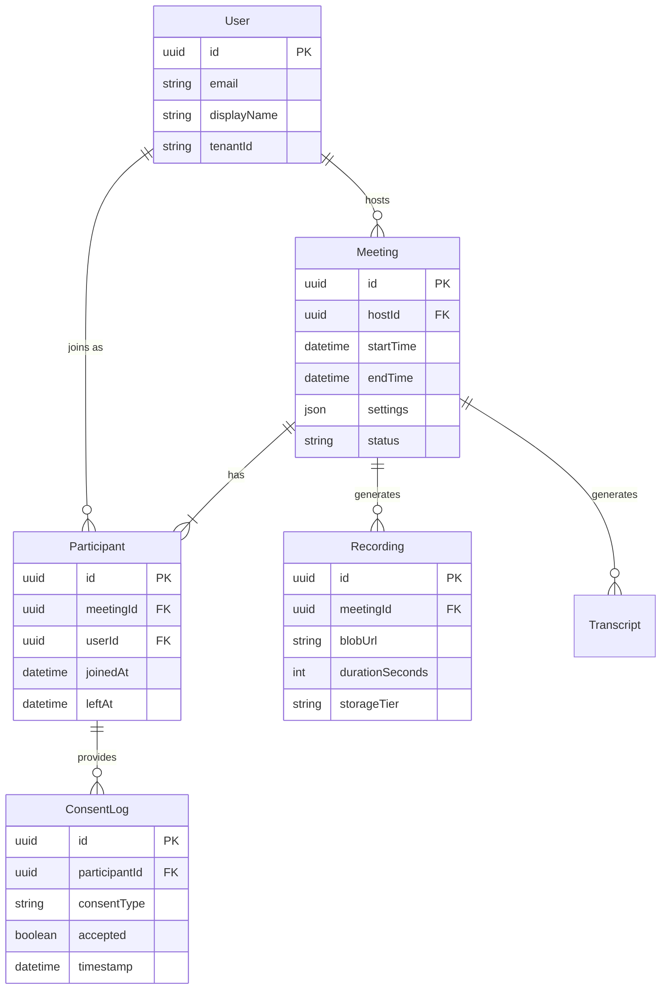
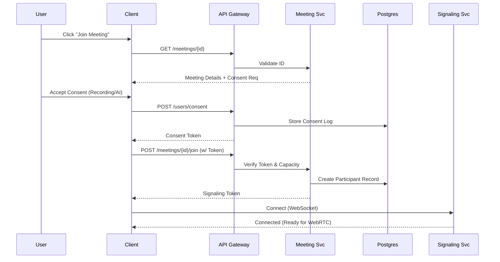
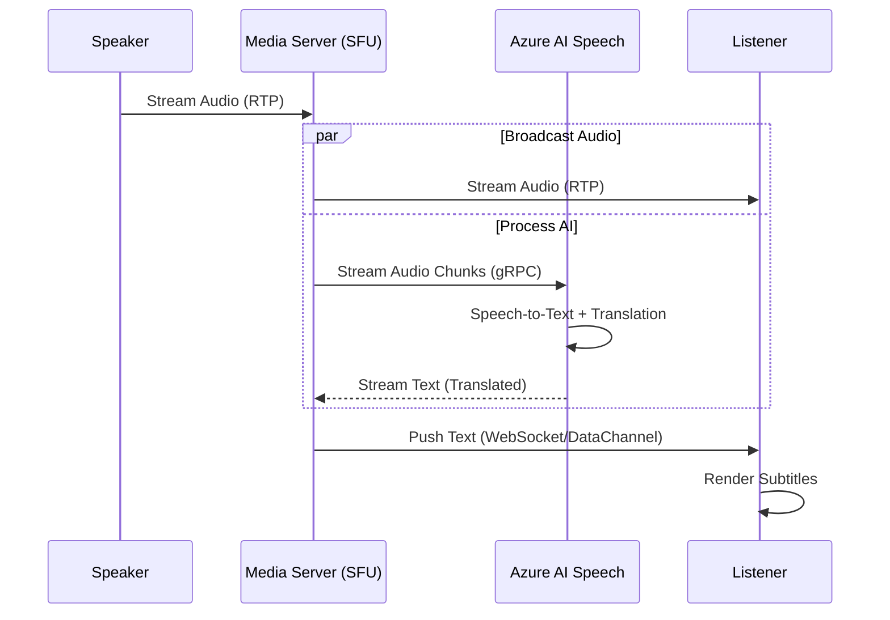
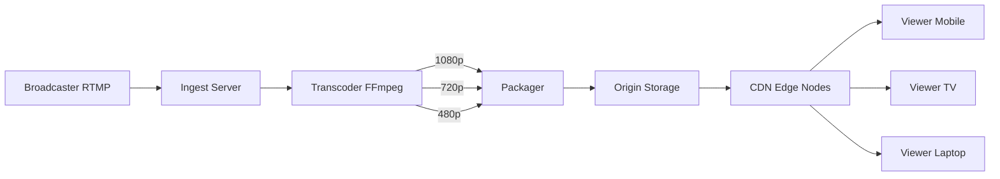
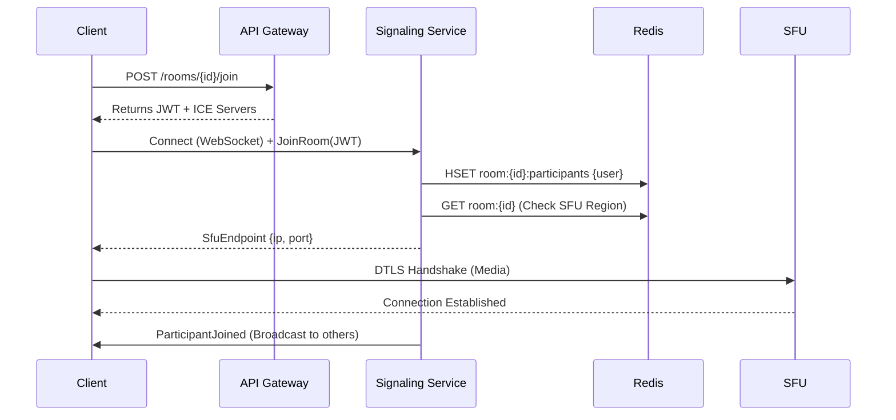
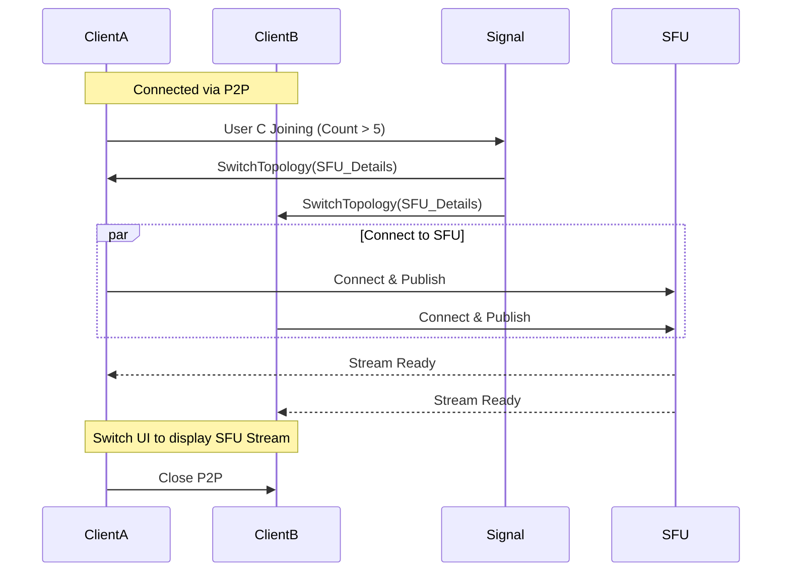
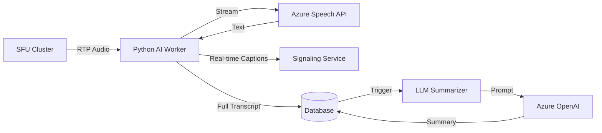

# Detailed Design: Complete Architecture & Implementation

> **Context**: This comprehensive document covers all detailed design aspects of the AI-enhanced video conferencing system, from API design to infrastructure scaling.

## Table of Contents

- [Part A: API Design & Data Model](#part-a-api-design--data-model)
  - [1. API Design](#1-api-design)
  - [2. Data Model](#2-data-model)
- [Part B: Sequence Diagrams & Capacity Planning](#part-b-sequence-diagrams--capacity-planning)
  - [3. Sequence Diagrams](#3-sequence-diagrams)
  - [4. Capacity Planning](#4-capacity-planning)
- [Part C: Scalability Patterns](#part-c-scalability-patterns)
  - [1. Group Call Architecture](#1-group-call-architecture)
  - [2. Live Streaming Architecture](#2-live-streaming-architecture)
  - [3. Adaptive Bitrate & Transcoding](#3-adaptive-bitrate--transcoding)
- [Part D: Operational Excellence](#part-d-operational-excellence)
  - [1. Service Level Objectives (SLOs)](#1-service-level-objectives-slos)
  - [2. Observability Strategy](#2-observability-strategy)
  - [3. Operational Runbooks](#3-operational-runbooks)
- [Part E: Security & Compliance](#part-e-security--compliance)
  - [1. Authentication & Authorization](#1-authentication--authorization)
  - [2. Network Security](#2-network-security)
  - [3. Compliance & Data Privacy](#3-compliance--data-privacy)
- [Part F-A: Core Data Models](#part-f-a-core-data-models)
  - [1. Core Data Models](#1-core-data-models)
- [Part F-B: API Contracts & Redis Schema](#part-f-b-api-contracts--redis-schema)
  - [2. API Contracts](#2-api-contracts)
  - [3. Redis Schema Design for Scale](#3-redis-schema-design-for-scale)
  - [4. Sequence Diagram: Joining a Room](#4-sequence-diagram-joining-a-room)
- [Part G: Advanced Workflows & AI Integration](#part-g-advanced-workflows--ai-integration)
  - [1. Dynamic Switching (P2P <-> SFU)](#1-dynamic-switching-p2p--sfu)
  - [2. Recording Pipeline](#2-recording-pipeline)
  - [3. AI Worker Design (Python)](#3-ai-worker-design-python)
- [Part H: Infrastructure, Scalability & Analytics](#part-h-infrastructure-scalability--analytics)
  - [1. Network Resilience: HTTP Tunneling](#1-network-resilience-http-tunneling)
  - [2. Advanced Capacity Planning](#2-advanced-capacity-planning)
  - [3. Analytics & Observability Pipeline](#3-analytics--observability-pipeline)
  - [4. Hybrid Cloud Data Strategy](#4-hybrid-cloud-data-strategy)

---

## Part A: API Design & Data Model

### 1. API Design

The system exposes a set of RESTful APIs for management and signaling, while media streaming uses WebRTC/RTP.

#### Meeting Management (REST)

| Method | Endpoint | Description | Request Body |
| :--- | :--- | :--- | :--- |
| `POST` | `/v1/meetings` | Create a new meeting | `{ "hostId": "uuid", "scheduledTime": "iso8601", "settings": { "aiEnabled": true } }` |
| `GET` | `/v1/meetings/{id}` | Get meeting details | - |
| `POST` | `/v1/meetings/{id}/join` | Request to join (returns token) | `{ "userId": "uuid", "password": "..." }` |
| `PUT` | `/v1/meetings/{id}/end` | End the meeting | - |

#### User & Consent (REST)

| Method | Endpoint | Description | Request Body |
| :--- | :--- | :--- | :--- |
| `POST` | `/v1/users/consent` | Record user consent | `{ "meetingId": "uuid", "consentType": "recording_ai", "status": "accepted" }` |
| `GET` | `/v1/users/{id}/profile` | Get user profile | - |

#### Real-Time Signaling (WebSocket)

*   **Endpoint**: `wss://api.meet.com/v1/signal`
*   **Events**:
    *   `join_room`: Client joins the signaling channel.
    *   `offer` / `answer`: WebRTC SDP exchange.
    *   `ice_candidate`: Network connectivity candidates.
    *   `transcript_update`: Push real-time AI transcriptions to client.

### 2. Data Model

We use a relational database (Postgres) for structured metadata and consistency.

#### Entity Relationship Diagram (Mermaid)

#### Schema Considerations

*   **Sharding**: For scale (2,000+ concurrent meetings), we may shard the `Participant` and `Transcript` tables by `MeetingId`.
*   **Indexes**:
    *   `Meeting(hostId, startTime)`: For listing a user's meetings.
    *   `Participant(meetingId, userId)`: For quick lookup of who is in a meeting.

---

## Part B: Sequence Diagrams & Capacity Planning

### 3. Sequence Diagrams

#### Flow 1: User Joins Meeting with Consent

This flow ensures compliance before allowing media connection.

#### Flow 2: Real-Time AI Translation

This flow demonstrates the low-latency streaming path.

### 4. Capacity Planning

#### Assumptions
*   **Concurrent Users**: 2,000
*   **Video Quality**: 720p (approx. 1.5 Mbps per stream)
*   **Audio Quality**: 64 kbps
*   **Meeting Duration**: 1 hour average

#### Bandwidth Estimation
*   **Per User**: 1.5 Mbps (Up) + 1.5 Mbps (Down) = 3 Mbps.
*   **Total Bandwidth**: 2,000 users * 3 Mbps = **6,000 Mbps (6 Gbps)**.
*   **Implication**: Requires high-throughput networking (Azure Standard/Premium Networking) and potentially CDN for static assets, though media traffic goes through SFU clusters.

#### Storage Estimation (Recordings)
*   **Video Size**: 1.5 Mbps * 3600 sec = 5,400 Mb ≈ **675 MB per hour**.
*   **Total Storage Per Hour**: 2,000 users (assuming 500 meetings of 4 people) -> 500 recordings.
*   **Volume**: 500 recordings * 675 MB = **337.5 GB per hour**.
*   **Daily Volume (8 busy hours)**: ~2.7 TB / day.
*   **Implication**: Aggressive lifecycle management (tiering to Cool/Archive) is critical to control costs.

#### Compute (AI Services)
*   **Translation**: 2,000 concurrent streams.
*   **Quota**: Standard Azure AI tiers may throttle. Need **Provisioned Throughput Units (PTU)** for guaranteed capacity at this scale.

---

## Part C: Scalability Patterns

### 1. Group Call Architecture

Scaling from 1:1 to N:N requires different architectural patterns based on the number of participants.

#### A. Mesh Topology (Peer-to-Peer)

* **Concept**: Every participant connects directly to every other participant.
* **Bandwidth Cost**: $(N-1)$ uplinks and $(N-1)$ downlinks per user.
* **Suitability**: Small groups (N ≤ 5).
* **Pros**: Low latency, low server cost (only signaling).
* **Cons**: CPU and bandwidth intensive for clients.

#### B. SFU (Selective Forwarding Unit)

* **Concept**: Participants send **one** uplink stream to a central server (SFU). The SFU forwards that stream to all other participants.
* **Bandwidth Cost**: 1 uplink and $(N-1)$ downlinks per user.
* **Suitability**: Medium to Large groups (5 < N < 50).
* **Pros**: Reduces client uplink load. Enables features like recording and simulcast.
* **Cons**: Higher server bandwidth costs.

#### C. MCU (Multipoint Control Unit)

* **Concept**: The server mixes all incoming streams into a single composite video stream and sends it back.
* **Bandwidth Cost**: 1 uplink and 1 downlink per user.
* **Suitability**: Legacy systems or very low bandwidth clients.
* **Pros**: Lowest client bandwidth.
* **Cons**: Extremely high server CPU cost (decoding + mixing + encoding). High latency.

**Decision**: We will use a **Hybrid Approach**.

* **N ≤ 5**: Attempt P2P Mesh.
* **N > 5**: Switch to SFU (via Azure Communication Services or LiveKit).

### 2. Live Streaming Architecture (One-to-Millions)

For broadcasting events (e.g., Sports, Town Halls) to millions of users, WebRTC is not scalable. We use a **CDN-based delivery** with HLS/DASH.

#### Architecture Flow

1. **Ingest**: The broadcaster sends a high-quality RTMP/SRT stream to an **Ingest Server**.
2. **Transcoding**: The stream is converted into multiple bitrates/resolutions (1080p, 720p, 480p) for **Adaptive Bitrate Streaming (ABR)**.
3. **Packaging**: Transcoded streams are segmented into small chunks (2-6 seconds) and manifest files (.m3u8 / .mpd) are created.
4. **Distribution**: Chunks are pushed to a **CDN (Content Delivery Network)** (e.g., Azure CDN, Cloudflare).
5. **Playback**: Viewers fetch chunks from the nearest CDN edge node using HLS (HTTP Live Streaming) or DASH.

### 3. Adaptive Bitrate & Transcoding

To support users with varying network conditions, we implement **Simulcast** (for SFU) and **ABR** (for HLS).

* **Simulcast (WebRTC)**: The sender publishes multiple qualities (High, Med, Low) to the SFU. The SFU detects the receiver's bandwidth and forwards the appropriate stream.
* **ABR (HLS/DASH)**: The player detects available bandwidth and automatically switches between quality levels defined in the manifest file.

#### Handling Network Fluctuations

* **Client-Side**: The application monitors packet loss and RTT. If thresholds are exceeded, it requests a lower quality stream or disables video.
* **Server-Side**: The SFU drops video packets (falling back to audio-only) if the downlink is congested.

---

## Part D: Operational Excellence

### 1. Service Level Objectives (SLOs)

For a real-time system, availability alone is insufficient. We must track latency
and quality.

| Metric | Target (SLO) | Measurement Window |
| :--- | :--- | :--- |
| **Signaling Availability** | 99.9% | Monthly |
| **Media Latency (P95)** | < 250 ms | Rolling 5-min |
| **Packet Loss** | < 2% | Per Session |
| **Join Success Rate** | > 99% | Daily |
| **TURN Success Rate** | > 99% | Daily |

**Alerting Thresholds**:

* **Critical**: SFU CPU > 80%, Packet Loss > 5% (sustained 1 min).
* **Warning**: TURN Bandwidth > 70% capacity, Join Latency > 2s.

### 2. Observability Strategy

We employ a multi-layer monitoring approach to capture system health and user experience.

#### A. Client-Side Telemetry

* **Mechanism**: WebRTC `getStats()` API.
* **Metrics**: RTT (Round Trip Time), Jitter, Packet Loss, Bitrate, Frame Rate.
* **Transport**: Sent via DataChannel to Signaling Server every 10-30 seconds.

#### B. Server-Side Metrics (Prometheus)

* **Signaling**: Active connections, Message rate, Redis latency, Token validation
  failures.
* **SFU**: Aggregate forwarding bitrate, Active publishers/subscribers, CPU/Memory
  usage.
* **TURN**: Egress bandwidth, Active allocations, Auth failures.

#### C. Distributed Tracing (OpenTelemetry)

* Trace the full `join_room` flow: Client → Front Door → API Gateway →
  Signaling → Redis → SFU.
* Identify bottlenecks in room creation or media negotiation.

#### D. Local Observability (.NET Aspire Dashboard)

* **Tool**: **.NET Aspire Dashboard**.
* **Usage**: Provides a real-time view of logs, traces, and metrics during local development and testing.
* **Benefit**: Simplifies debugging of distributed microservices (Signaling, API, Workers) without needing a full cloud setup.

### 3. Operational Runbooks

Standardized procedures for incident response.

#### Playbook: SFU Saturation

**Trigger**: SFU Node CPU > 85% or Packet Loss > 3%.

1. **Automated Action**: Horizontal Pod Autoscaler (HPA) adds new SFU pods.
2. **Traffic Shift**: Signaling Server stops assigning new rooms to the saturated
   region/node.
3. **Investigation**: Check for "noisy neighbor" rooms (e.g., 50+ active speakers).
4. **Mitigation**: Enforce stricter bitrate limits on existing publishers in that
   node.

#### Playbook: High TURN Usage

**Trigger**: TURN Egress Bandwidth > Threshold.

1. **Analysis**: Identify if a specific region or ISP is forcing relay (Symmetric
   NAT).
2. **Scaling**: Scale out TURN VM Scale Set (VMSS).
3. **Optimization**: Verify STUN configuration on clients (ensure P2P is attempted
   first).

#### Playbook: Recording Failure

**Trigger**: Recording worker error rate > 1%.

1. **Fallback**: Enable client-side local recording (if supported) or audio-only
   backup.
2. **Recovery**: Re-queue failed chunks for post-processing.
3. **Notification**: Alert users of potential delay in recording availability.

---

## Part E: Security & Compliance

### 1. Authentication & Authorization

We adopt a **Zero Trust** model where every connection is authenticated.

#### A. Identity Provider (IdP)

* **Azure AD / B2C**: Handles user identity (OAuth2/OIDC).
* **Flow**: Client logs in → Gets ID Token → Exchanges for **Short-Lived Join
  Token**.

#### B. Short-Lived Tokens

* **Join Token**: JWT signed by the Auth Service, valid for 5-10 minutes. Contains
  `roomId`, `userId`, and `role` (Host/Participant).
* **TURN Credentials**: Ephemeral username/password generated via REST API
  (Time-Limited). Prevents unauthorized relay usage.

### 2. Network Security

#### A. Control Plane

* **TLS 1.3**: All Signaling (HTTPS/WSS) traffic is encrypted.
* **WAF (Web Application Firewall)**: Azure Front Door protects against DDoS and
  Layer 7 attacks.
* **Private Link**: Backend services (Redis, SQL, Blob) are accessed only via
  private endpoints, never public internet.

#### B. Media Plane

* **DTLS (Datagram Transport Layer Security)**: Key exchange for media streams.
* **SRTP (Secure Real-time Transport Protocol)**: Encrypts the actual audio/video
  payload.
* **E2EE (End-to-End Encryption)**: *Optional*. Keys exchanged between clients; SFU
  cannot decrypt media. (Trade-off: No server-side recording/transcription).

### 3. Compliance & Data Privacy

#### A. Recording Consent

* **Workflow**: Host initiates recording → System broadcasts "Recording Started"
  event → Clients display UI indicator.
* **Storage**: Recordings stored in Azure Blob Storage with **Customer-Managed Keys
  (CMK)**.

#### B. Data Residency

* **Regional Isolation**: Media traffic stays within the user's region (e.g., EU
  users routed to EU SFU clusters).
* **Metadata**: Stored in geo-replicated databases compliant with GDPR/CCPA.

#### C. Audit Logs

* **Events**: Login attempts, Room creation, Recording access, Participant join/leave.
* **Storage**: Azure Monitor / Log Analytics with retention policies.

---

## Part F-A: Core Data Models

### 1. Core Data Models

The system requires a robust data model to handle users, rooms, and sessions.
We separate **Persistent Data** (SQL/Cosmos) from **Ephemeral Data** (Redis).

#### A. Persistent Models (SQL / Cosmos DB)

These models store long-term history and configuration.

##### `User`

* **id** (UUID): Unique identifier.
* **email** (String): User email.
* **displayName** (String): Public name.
* **tenantId** (UUID): For multi-tenant support.
* **createdAt** (Timestamp).

##### `Room`

* **id** (UUID): Unique meeting identifier.
* **hostUserId** (UUID): Owner of the meeting.
* **settings** (JSON):
  * `isRecordingEnabled`: boolean
  * `maxParticipants`: integer
  * `allowedRoles`: ["host", "guest"]
* **status** (Enum): `SCHEDULED`, `ACTIVE`, `COMPLETED`.
* **createdAt** (Timestamp).

##### `Session` (Meeting Instance)

* **id** (UUID): Unique session ID (a room can have multiple sessions over time).
* **roomId** (UUID): FK to Room.
* **startTime** (Timestamp).
* **endTime** (Timestamp).
* **recordingUrl** (String): Path to the final recording in Blob Storage.

#### B. Ephemeral Models (Redis)

These models exist only while a meeting is active.

##### `RoomState` (Hash)

* **Key**: `room:{roomId}`
* **Fields**:
  * `sfuRegion`: "us-east-1" (Sticky region for the meeting)
  * `participantCount`: Integer
  * `isRecording`: Boolean

##### `ParticipantState` (Hash)

* **Key**: `room:{roomId}:participants`
* **Fields**: `userId` -> JSON
  * `connectionId`: SignalR/WebSocket connection ID.
  * `role`: "host" | "attendee".
  * `isMuted`: Boolean.
  * `isVideoOn`: Boolean.
  * `joinedAt`: Timestamp.

---

## Part F-B: API Contracts & Redis Schema

### 2. API Contracts

#### A. REST API (Control Plane)

Used for meeting management and history.

<!-- markdownlint-disable MD013 -->
| Method | Endpoint | Description | Request Body | Response |
| :--- | :--- | :--- | :--- | :--- |
| **POST** | `/v1/rooms` | Create a new room | `{ "hostId": "...", "settings": {...} }` | `{ "roomId": "...", "joinToken": "..." }` |
| **POST** | `/v1/rooms/{id}/join` | Request to join | `{ "userId": "..." }` | `{ "token": "jwt...", "iceServers": [...] }` |
| **GET** | `/v1/rooms/{id}/recordings` | Get recordings | - | `[{ "url": "...", "duration": 120 }]` |
<!-- markdownlint-enable MD013 -->

#### B. Signaling API (WebSocket / SignalR)

Used for real-time session negotiation.

##### Client -> Server Events

1. **`JoinRoom`**
   * **Payload**: `{ "roomId": "...", "token": "..." }`
   * **Action**: Server validates token, adds user to Redis, notifies others.

2. **`SendOffer`** (WebRTC SDP)
   * **Payload**: `{ "targetUserId": "...", "sdp": "v=0..." }`
   * **Action**: Server forwards SDP to the target user (P2P) or SFU.

3. **`SendAnswer`** (WebRTC SDP)
   * **Payload**: `{ "targetUserId": "...", "sdp": "v=0..." }`
   * **Action**: Server forwards Answer to the target user or SFU.

4. **`SendIceCandidate`**
   * **Payload**: `{ "targetUserId": "...", "candidate": "..." }`
   * **Action**: Server forwards ICE candidate to assist connectivity.

5. **`UpdateState`**
   * **Payload**: `{ "isMuted": true, "isVideoOn": false }`
   * **Action**: Server updates Redis and broadcasts `StateChanged` event.

##### Server -> Client Events

1. **`ParticipantJoined`**
   * **Payload**: `{ "userId": "...", "displayName": "..." }`

2. **`ReceiveOffer` / `ReceiveAnswer`**
   * **Payload**: `{ "sourceUserId": "...", "sdp": "..." }`

3. **`IceCandidate`**
   * **Payload**: `{ "sourceUserId": "...", "candidate": "..." }`

4. **`SfuEndpoint`** (For SFU topology)
   * **Payload**: `{ "ip": "10.0.0.1", "port": 40000, "transportId": "..." }`
   * **Description**: Tells the client which SFU node to connect to.

### 3. Redis Schema Design for Scale

To handle millions of users, we structure Redis keys to allow atomic operations
and easy cleanup.

* **Room Expiry**: Set TTL on `room:{roomId}` keys. Refresh TTL on every
  `JoinRoom` or `KeepAlive` event.
* **Atomic Counts**: Use `HINCRBY` on `room:{roomId}` `participantCount` to
  maintain accurate numbers without race conditions.
* **Geo-Distribution**: Use Redis Enterprise or Azure Managed Redis
  (Geo-Replication) if the control plane spans multiple regions, though
  typically we stick a room to a specific region to avoid conflict.

### 4. Sequence Diagram: Joining a Room

---

## Part G: Advanced Workflows & AI Integration

### 1. Dynamic Switching (P2P <-> SFU)

A key optimization is dynamically switching between Peer-to-Peer (Mesh) and
Server-Based (SFU) topologies based on network conditions or participant count.

#### Trigger Conditions

1. **Participant Count**: If N > 5, switch to SFU.
2. **Network Instability**: If packet loss > 5% on P2P link, switch to SFU
   (which may have a better route).
3. **Feature Request**: If a user starts "Recording", switch to SFU (server
   needs the stream).

#### Switching Workflow

The transition must be seamless. We use a "Make before Break" approach.

1. **Detection**: Client or Server detects a trigger condition (e.g., 6th
   person joins).
2. **Signaling**: Server sends `SwitchTopology` command to all clients with
   SFU credentials.
3. **Connection**: Clients establish connection to SFU *while keeping P2P
   active*.
4. **Stream Switch**: Once SFU connection is stable, clients switch their
   `MediaStreamTrack` source to the SFU stream.
5. **Teardown**: Clients close the P2P connections.

### 2. Recording Pipeline

Recording is not just "saving to disk". It involves capturing, buffering,
merging, and storing.

#### Architecture

1. **Logger Service (Ingest)**:
   * Receives RTP packets from the SFU (or acts as a silent participant).
   * Buffers packets in memory/local disk (Jitter Buffer).
   * Writes raw chunks (e.g., `.webm` or `.ts`) to a **Temporary Storage**
     (Hot Blob / DFS).
2. **File Creator (Processor)**:
   * Listens for `MeetingEnded` event.
   * Retrieves all chunks for the `meetingId`.
   * **Transcoding/Merging**: Uses FFmpeg to merge audio/video tracks and
     multiple chunks into a single `.mp4` file.
   * **Upload**: Pushes final file to **Permanent Storage** (Cold Blob).
3. **Notification**:
   * Updates `Session` record in DB with `recordingUrl`.
   * Notifies users via Email/Push.

#### Data Flow

`SFU` -> (RTP) -> `Logger Service` -> (Chunks) -> `Temp Blob` ->
`File Creator` -> (FFmpeg) -> `Final Blob`

### 3. AI Worker Design (Python)

We use Python for its rich AI ecosystem (PyTorch, Azure SDKs). These workers
operate asynchronously.

#### Components

1. **Audio Ingest**:
   * SFU forwards a dedicated audio stream (mixed or single user) to the
     **AI Worker**.
   * Protocol: RTP or gRPC stream.
2. **Transcription Worker (FastAPI + Azure Speech)**:
   * Receives audio stream.
   * Uses **Azure Cognitive Services (Speech-to-Text)** or local **Whisper**
     model.
   * Generates real-time captions (sent back via WebSocket) and a final
     transcript (saved to DB).
3. **Summarization Worker (LLM)**:
   * Triggered after meeting ends.
   * Reads the full transcript.
   * Uses **Azure OpenAI (GPT-4)** to generate:
     * Summary
     * Action Items
     * Sentiment Analysis
   * Saves results to `MeetingMetadata` table.

#### Python Worker Architecture

#### Tech Stack for AI Workers

* **Runtime**: Python 3.11+
* **Framework**: FastAPI (for health checks/control), `aiortc` (for
  WebRTC/RTP handling).
* **Libraries**: `azure-cognitiveservices-speech`, `openai`, `langchain`.
* **Deployment**: Kubernetes Pods (Autoscaled on CPU/GPU usage).

---

## Part H: Infrastructure, Scalability & Analytics

### 1. Network Resilience: HTTP Tunneling

While UDP is the preferred transport for real-time media, enterprise firewalls and strict proxies often block non-standard ports or UDP traffic. To ensure **100% connectivity**, we must implement a fallback mechanism.

#### The Fallback Strategy

1. **Primary**: UDP (SRTP) via STUN.
2. **Secondary**: TCP (SRTP) via TURN (Port 443).
3. **Tertiary (Last Resort)**: **HTTP Tunneling**.

#### HTTP Tunneling Mechanism

* **Concept**: Encapsulate media and signaling packets within standard HTTP/HTTPS requests.
* **Implementation**:
  * The client opens a persistent HTTP connection (or uses long-polling/WebSockets over 443).
  * Media packets are base64 encoded (or binary) and sent as the HTTP body.
  * The server (or a specialized Gateway) unwraps the packets and forwards them to the SFU/Media Server.
* **Trade-offs**:
  * **Pros**: Works through almost any firewall or proxy.
  * **Cons**: High overhead (HTTP headers), TCP Head-of-Line blocking (latency spikes), increased CPU usage.

### 2. Advanced Capacity Planning (The "Billion User" Scenario)

Designing for massive scale requires rigorous math. Let's estimate the capacity for a system serving **1 Billion Users** with **100 Million Daily Group Calls**.

#### A. Traffic Estimation

* **Daily Calls**: 100 Million.
* **Peak Traffic**: Assuming a 10-hour active window.
  * $100,000,000 \text{ calls} / (10 \times 3600) \approx 2,777 \text{ calls/sec}$.
  * If each call generates ~20 signaling requests (join, leave, mute, status), that's $\approx 56,000 \text{ requests/sec}$.
* **Design Target**: Round up to **60,000 requests/sec** for the Signaling/API layer.

#### B. Storage Estimation (Recordings)

* **Assumptions**:
  * 1% of calls are recorded.
  * Average recording size: 100MB (compressed).
  * Daily Recordings: $100,000,000 \times 0.01 = 1,000,000$ recordings.
* **Daily Storage**: $1,000,000 \times 100 \text{ MB} = 100,000,000 \text{ MB} = 100 \text{ TB/day}$.
* **Annual Storage**: $100 \text{ TB} \times 365 \approx 36.5 \text{ PB/year}$.
* **Strategy**: Tiered Storage (Hot -> Cool -> Archive) is mandatory.

#### C. Bandwidth & Latency Targets

* **Latency Budget**:
  * **One-way Trip**: < 150ms is acceptable, but **< 64ms** is the target for "in-room" feel.
  * **Round Trip (RTT)**: < 128ms.
* **Bandwidth per Group Call (100 users)**:
  * If using SFU with Simulcast (High: 1Mbps, Low: 100kbps).
  * Ingress (Server): 100 users $\times$ 1Mbps = 100 Mbps.
  * Egress (Server): 100 users $\times$ (1 High + 5 Thumbnails) $\approx$ 100 $\times$ 1.5Mbps = 150 Mbps.
  * **Total per Call**: ~250 Mbps throughput.

### 3. Analytics & Observability Pipeline

To maintain quality at this scale, we need a dedicated Big Data pipeline to analyze **Quality of Service (QoS)** metrics (jitter, packet loss, RTT) and **User Engagement**.

#### Architecture

1. **Data Ingestion**:
   * Clients send QoS events (every 30s) and "Call End" summaries to a **WebSocket Handler**.
   * Handler pushes events to a **Kafka** topic (`telemetry-events`).

2. **Processing Layer**:
   * **Real-time (Flink/Spark Streaming)**: Detects network outages, bad releases, or regional failures. Alerts Ops immediately.
   * **Batch (Hadoop/Spark)**: Aggregates daily trends, user retention, and feature usage.

3. **Storage**:
   * **Time-Series DB (InfluxDB/Prometheus)**: For operational metrics (CPU, Memory, Latency).
   * **Data Lake (S3/HDFS)**: For raw event logs and long-term analysis.

#### Key Metrics to Track

* **Mean Opinion Score (MOS)**: Calculated from packet loss and jitter.
* **Join Time**: Time from "Click Join" to "Media Connected".
* **Reconnection Rate**: How often users drop and reconnect.

### 4. Hybrid Cloud Data Strategy

At massive scale, a single database technology or cloud provider might not suffice. We can adopt a **Polyglot & Hybrid** persistence strategy.

* **Metadata (AWS/Azure)**:
  * **Users, Meetings, Schedules**: Hosted on managed Relational Databases (Aurora/SQL Database) for ACID compliance and high availability.
  * **Sharding**: Sharded by `User_ID` or `Org_ID`.

* **Media Storage (Object Store)**:
  * **Recordings**: Stored in S3/Blob Storage. Cheaper and infinitely scalable.

* **Specialized Resources (Oracle/Other)**:
  * If the system serves specific verticals (e.g., Education), static resources or legacy data might reside in a specialized cloud or on-premise data center for compliance or cost reasons.

---

## Next Steps: Implementation

This detailed design document provides comprehensive technical specifications for all aspects of the system. To proceed with implementation:

- **[Tech Stack & Engineering Strategy](./04_Implementation-Plan.md)** - Technology selection, microservices architecture, and CI/CD strategy

